# Ocho

A minimal, production-quality Android workout interval timer, built to stay readable
when you're mid-effort and not looking at the screen.

[](https://github.com/daniel-kindl/ocho/actions/workflows/dev-ci.yml)
[](https://github.com/daniel-kindl/ocho/actions/workflows/release.yml)
[](https://github.com/daniel-kindl/ocho/releases/latest)
[](LICENSE)
[](https://developer.android.com/)
[](https://kotlinlang.org)

Project site: [daniel-kindl.github.io/ocho](https://daniel-kindl.github.io/ocho/)

*An **ocho** is a figure-eight step in tango. It's also Spanish for **eight**, the
round count of a classic Tabata.*

---

## Screenshots

<p align="center">
  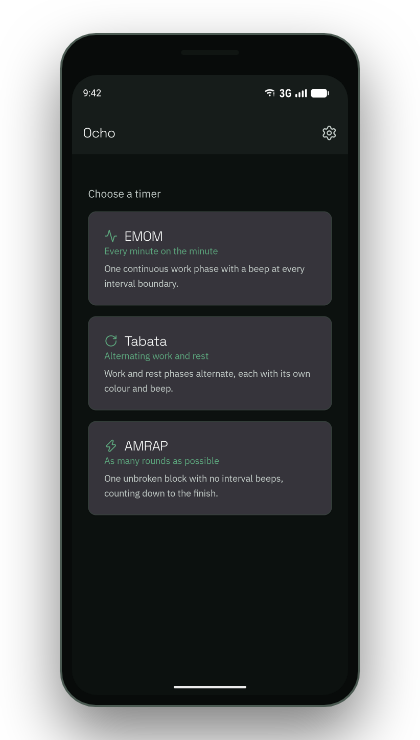
  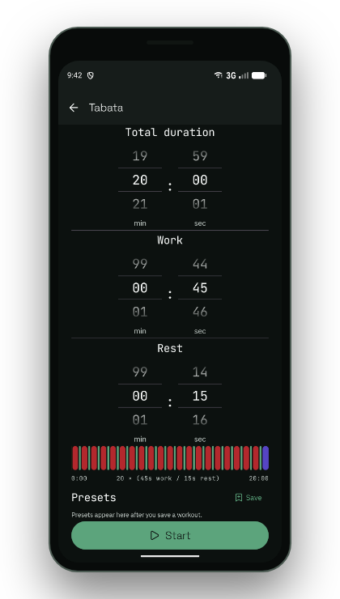
  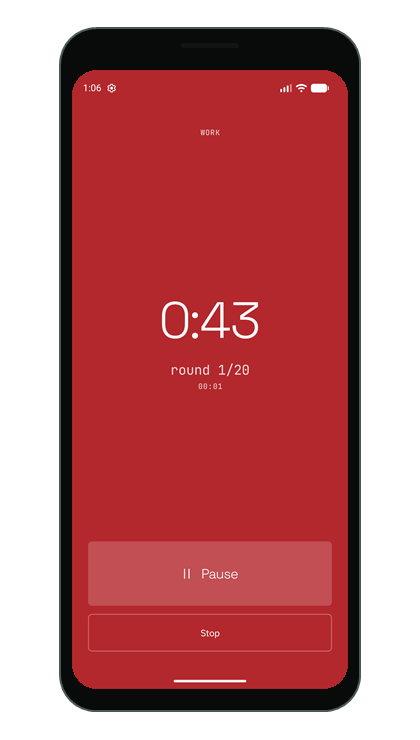
  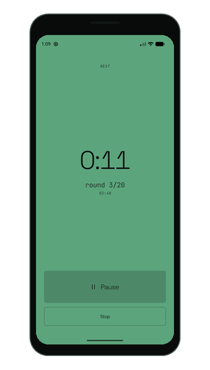
</p>

<p align="center">
  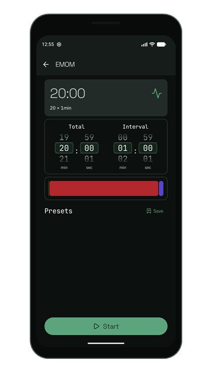
  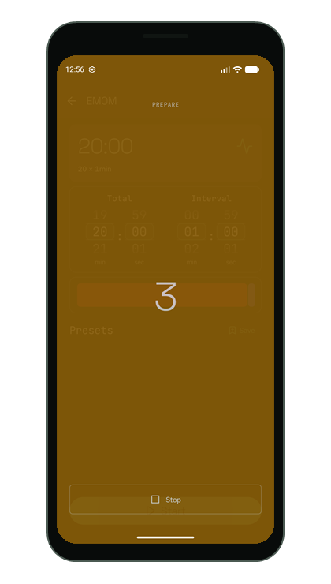
  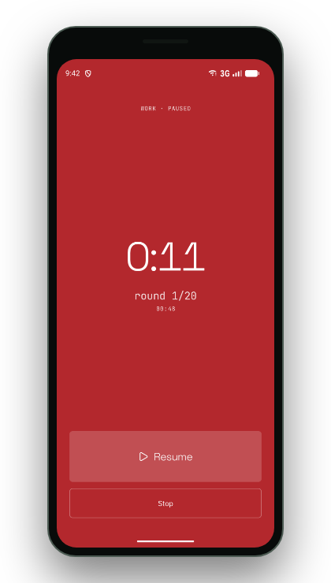
  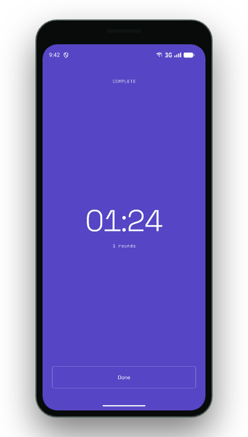
</p>

<p align="center">
  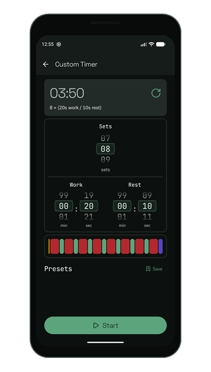
  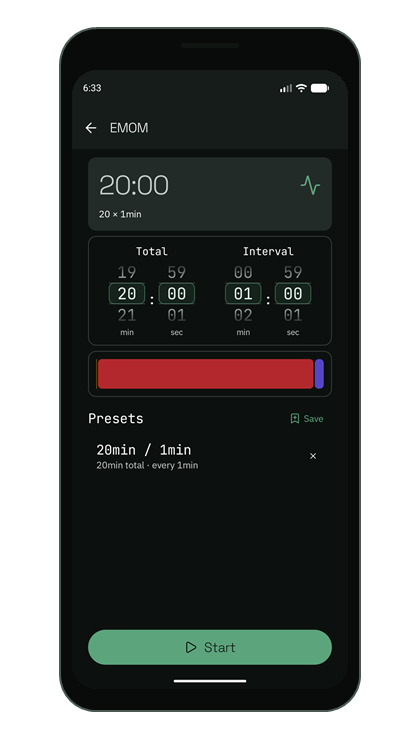
  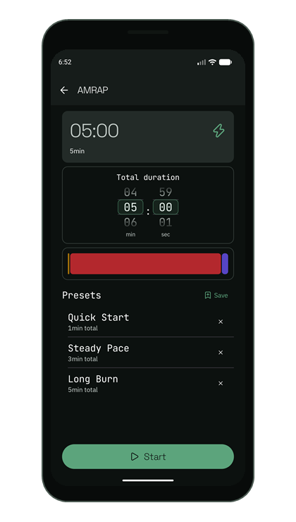
</p>

These Pixel 9a captures cover the full flow: choosing a mode, configuring a set,
preparing, working, pausing, resting, and completing a session. The bar above Start
previews the shape of the workout before it begins. The preset capture shows the
current compact two-line list used across every timer mode. The AMRAP example uses
three distinct saved workouts—Quick Start (1 min), Steady Pace (3 min), and Long
Burn (5 min)—so each row's total-duration summary is easy to compare.

While a session runs the plate is the entire interface, which is what makes it
readable across a room. Work and rest are separated by lightness as well as hue.

---

## Features

| Feature | Detail |
|---------|--------|
| EMOM timer | Total duration and interval length, set with drum-roll mm:ss pickers |
| Tabata timer | Total, work, and rest durations; phases alternate automatically |
| AMRAP timer | Total duration only; one unbroken block with no interval beeps |
| Custom Timer | Fixed set count with configurable work and rest durations; no final rest |
| Phase colours | A full-screen amber, red, green, or violet plate per phase, readable across a room and distinguishable without colour vision |
| Run timeline | Proportional preview of a workout's shape before you start it |
| Sound feedback | Distinct tones per event, on the alarm stream so silent mode can't mute them |
| Vibration feedback | Different patterns for intervals and for completion |
| Pause and resume | Freeze mid-session without drift or losing interval alignment |
| Pre-start countdown | Three seconds before the first interval, to get into position |
| Presets | Save, name, load, and delete configurations separately per mode; compact rows show a mode-specific summary |
| Progress and summary | A progress bar during the session, and a recap on completion |
| Exit confirmation | The back gesture and Stop both ask before ending a running session |
| In-app updates | GitHub variant uses GitHub Releases; Play variant uses Play-managed updates |
| Workout-first UI | Large high-contrast display, screen stays on, one-hand friendly |

---

## Install

Ocho has two alternative distribution channels. The [GitHub APK](https://github.com/daniel-kindl/ocho/releases/latest)
is manually installed and may require Android's unknown-app installation permission;
it retains the GitHub self-updater in Settings. The updater accepts only the official
release asset, checks the APK package identity before handing it to Android, and relies
on Android's signing-key verification for the final install decision. The Play variant
uses Play-managed flexible updates and does not contain the GitHub APK installer.

### Update channels

| Channel | Installs as | Source | Published |
|---------|-------------|--------|-----------|
| Stable | `Ocho` | `releases/latest` | On each tagged release from `main` |
| Dev | `Ocho Dev` | Newest prerelease | On every push to `dev` |

The two are separate apps with separate `applicationId`s and separate data, so a dev
build can be installed alongside the stable one and neither will offer the other's
updates. Dev builds exist to test changes before they reach `main`, so expect them
to break.

---

## Usage

**EMOM.** Set total duration and interval, then Start. The app beeps and vibrates at
every interval boundary. Pause freezes without drift; Stop ends early after
confirming.

**Tabata.** Set total, work, and rest. Phases alternate automatically with distinct
high and low beeps, and the whole screen switches between a dark red work plate and
a light green rest one.

**AMRAP.** Set total duration and go. Nothing interrupts you: no interval beeps, no
round counter, just the clock counting down and a 3-2-1 before it stops. Count your
own rounds.

**Custom Timer.** Set the number of work sets, work duration, and rest duration.
Rest runs between sets only, so the final work set ends the session immediately.

**Presets.** Tap Save in the Presets section to store the current configuration.
The name is pre-filled from the configuration, so edit it or accept it. Names are
limited to 50 Unicode characters, with a live counter in the save dialog. Tap a
compact preset row to load it; the summary below the name keeps the mode-specific
durations visible, while the trailing delete control removes it.

**Settings.** The icon on the home screen toggles sound and vibration independently,
holds feedback, licence, and privacy-policy links, and shows the distribution's
update flow.

---

## Building from source

Build requirements, the Gradle commands, release signing, the package layout, and the
reasoning behind the timing, session, and colour design are in
[docs/ARCHITECTURE.md](docs/ARCHITECTURE.md). Variant publishing and GPLv3 compliance
are documented in [docs/PUBLISHING.md](docs/PUBLISHING.md); the privacy policy is in
[docs/PRIVACY_POLICY.md](docs/PRIVACY_POLICY.md).

Useful verification commands are:

```powershell
./gradlew.bat :app:testGithubDebugUnitTest :app:testPlayDebugUnitTest
./gradlew.bat :app:compileGithubDebugAndroidTestKotlin :app:compilePlayDebugAndroidTestKotlin
```

The documented emulator pass and CI instrumentation workflow are described in
[docs/TESTING.md](docs/TESTING.md).

Local instrumentation and manual UI checks use the configured `Pixel_9a` Android
17 (API 37) emulator. Start it before running the connected test task and wait for
ADB to report the device as ready.

Localization is prepared but intentionally English-only for now. App strings and
plural rules live in Android resources; website copy lives in the typed Astro module
`website/src/i18n/en.ts`. See [docs/LOCALIZATION.md](docs/LOCALIZATION.md) before
adding a locale.

---

## Website

The GitHub Pages site is an Astro project in `website/`. Run it locally with:

```bash
cd website
npm ci
npm run dev
```

Create the production static output with `npm run build`. Pushes to `main` deploy
`website/dist/` to GitHub Pages through the Pages workflow. Pull requests that touch
the website build it without deploying; only pushes to `main` publish the site.

---

## Contributing

See [CONTRIBUTING.md](CONTRIBUTING.md) for branch rules, commit conventions, the
release process, and the [contributor terms](CONTRIBUTING.md#contributor-terms).
Security policy: [SECURITY.md](SECURITY.md).

---

## License

Ocho is free software under the [GNU General Public License v3.0](LICENSE). You
may use, study, modify and redistribute it. Anything you redistribute must also be
GPL-3.0 with source available.

Copyright © 2026 Daniel Kindl, sole copyright holder. Ocho may also be offered under
separate commercial terms.

The name "Ocho", the wordmark, and the numeral-8 icon are not covered by the GPL.
Fork freely, but rename and re-brand.

Bundled fonts (IBM Plex Sans, JetBrains Mono, and Space Grotesk, all SIL OFL 1.1)
and icons (Lucide, ISC) keep their own licences. Full texts are in
[THIRD-PARTY-NOTICES.md](THIRD-PARTY-NOTICES.md) and in the app under Settings,
then Licences.
